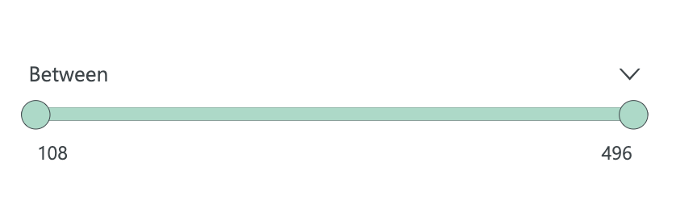

# Slider Filter 

## Screenshot

  

## Introduction 
Custom PowerBI Visual to filter quantitative data using a continuous slider. 

https://github.com/thelmaakosa/Power-BI-visual-SliderFilter/blob/main/SliderFilter.pdf

## Contributer(s)
- **Developer:** [Thelma Akosa](mailto:thelmaakosa107@gmail.com)
- **Tester:** [Ryan Fleming](mailto:thelmaakosa107@gmail.com)

## Documentation and Resources
- PowerBI Documentation: https://docs.microsoft.com/en-us/power-bi/developer/visuals/

-----

## Setup
### 1. Create Enviornment to Code Custom PowerBI visuals

- Follow documentation for setting up computer enviornment: https://docs.microsoft.com/en-us/power-bi/developer/visuals/environment-setup?tabs=windows

### 2. Load Repos to VS Code
    
- Click on `Clone` in Azure DevOps
- Click on `Clone in VS Code`
- Select new repository location on the computer

### 3. Initiate Development in PowerBI

- Launch terminal 
- Navigate to repository folder location using `cd folder path` command 
- `pbiviz start` command into terminal
- Log into https://app.powerbi.com and enable dev environment.

## Build

### Code Guidelines
- **Folder Structure:** Folder structure is dictated by PowerBI 

## Package

### Publish PowerBI Visual 
- Follow documentation for finalizing visual: (https://docs.microsoft.com/en-us/power-bi/developer/visuals/package-visual)
- Launch terminal 
- Navigate to repository folder location using `cd folder path` command 
- `pbiviz package` command into the terminal 
